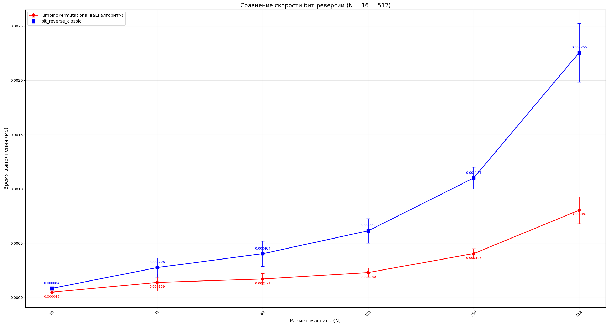
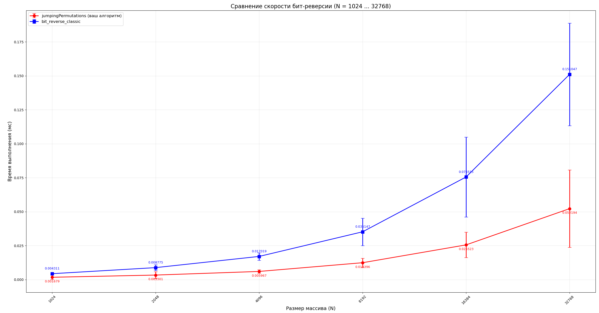
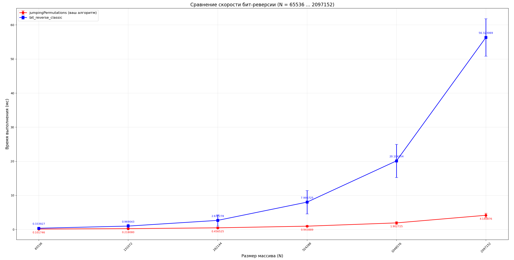
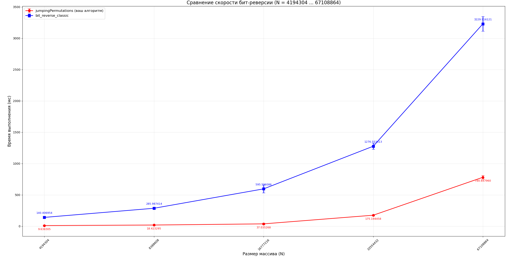
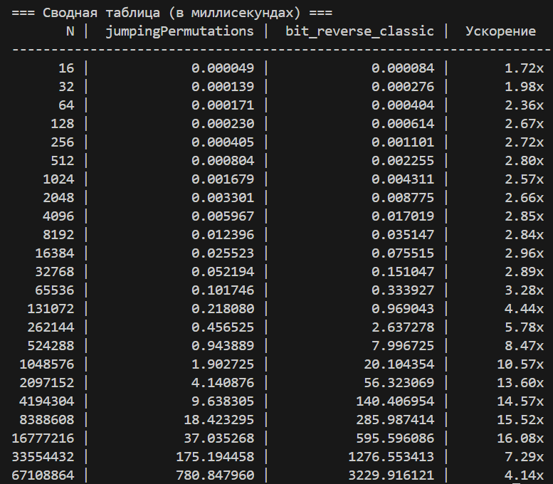
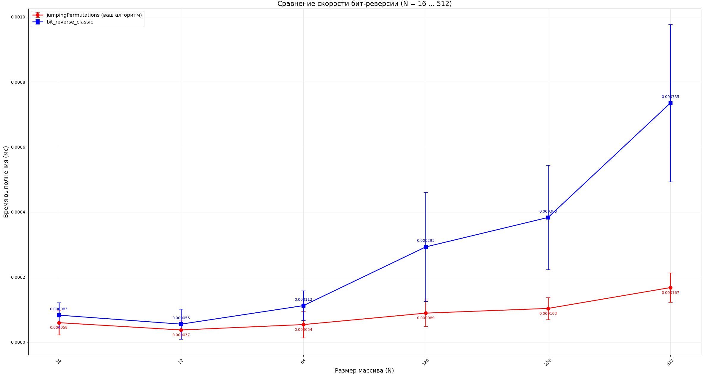
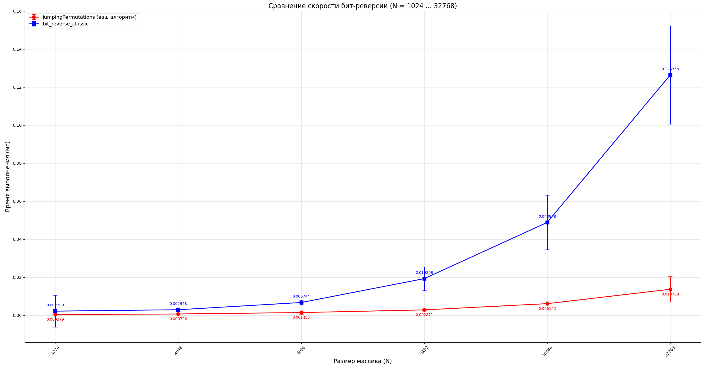
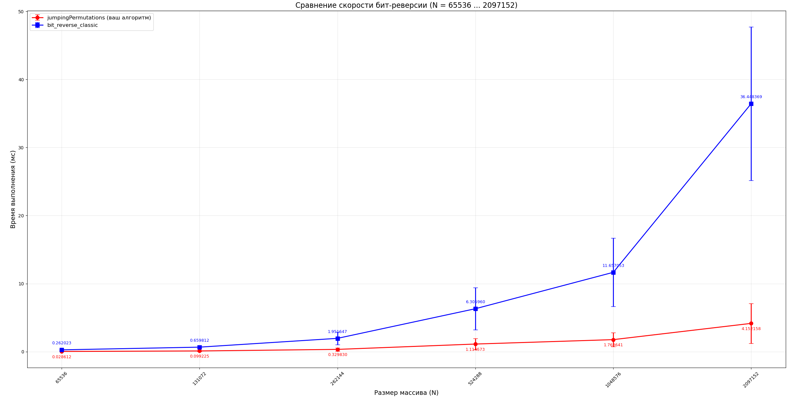
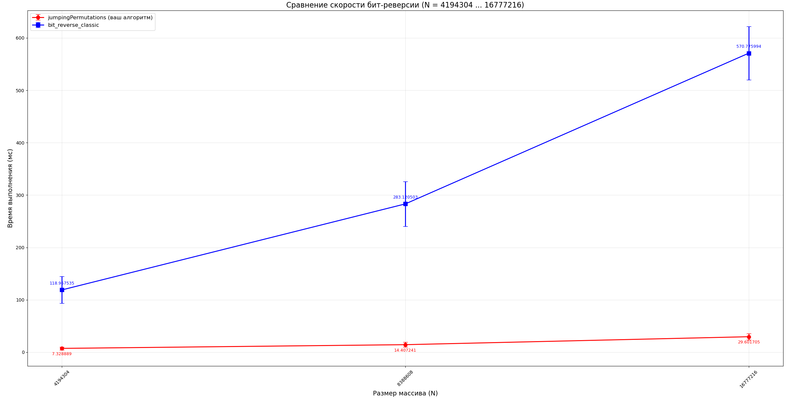
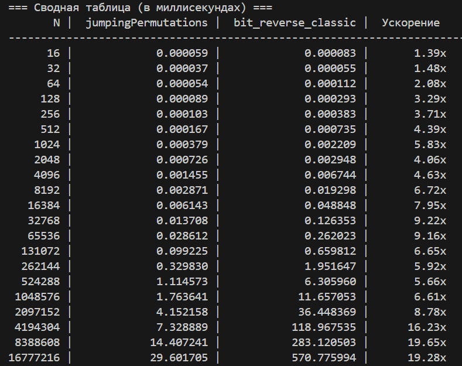

# Сравнение моего алгоритма jumping_permutations с алгоритмом bit_reverse
## Сравнение скорости выполнения без оптимизаций

При малых размерах массива (N < 2²⁴) данные помещаются в кэш-память процессора, и предложенный алгоритм показывает превосходство над классической реализацией за счёт уменьшения числа арифметических операций и устранения внутреннего цикла. Однако при N > 2²⁵ массив перестаёт помещаться в кэш L3, и определяющим фактором становится не вычислительная сложность, а паттерн доступа к памяти. Предложенный алгоритм использует непоследовательные прыжки, что приводит к частым промахам кэша и TLB, в то время как классический алгоритм сохраняет более последовательный доступ, позволяя аппаратному предсказателю эффективно загружать данные. Это объясняет снижение ускорения с 16.08x до 4.14x при переходе к N = 67 108 864.

## Сравнение скорости выполнения с -O3 оптимизацией и -march=native

После включения оптимизаций компилятора (-O3 -march=native) ускорение предложенного алгоритма относительно классического бит-реверса выросло (например, с 2.57× до 5.83× на N=1024). Это связано с тем, что классический алгоритм содержит внутренний цикл с зависимостью по данным, который невозможно векторизовать или эффективно развернуть, тогда как предложенный алгоритм состоит из линейных операций без зависимостей, что позволяет компилятору применить агрессивную оптимизацию и SIMD-инструкции. Однако на массивах свыше 16 млн элементов оба алгоритма упираются в пропускную способность оперативной памяти, поэтому дальнейший прирост от оптимизаций нивелируется, а ускорение стабилизируется на уровне 19×, после чего начинает снижаться из-за кэш-промахов.