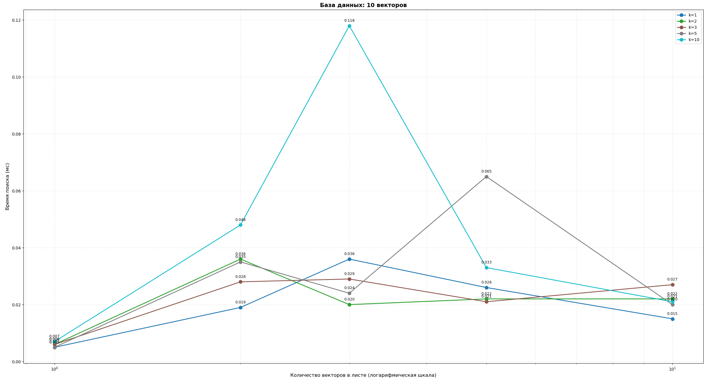
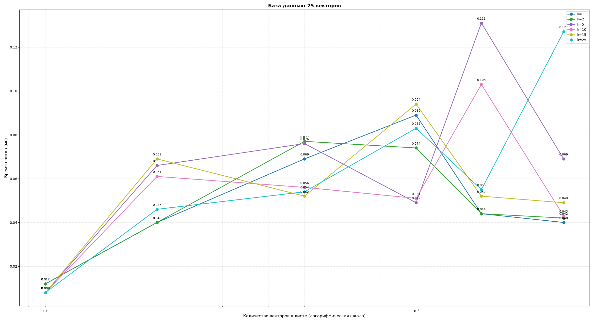
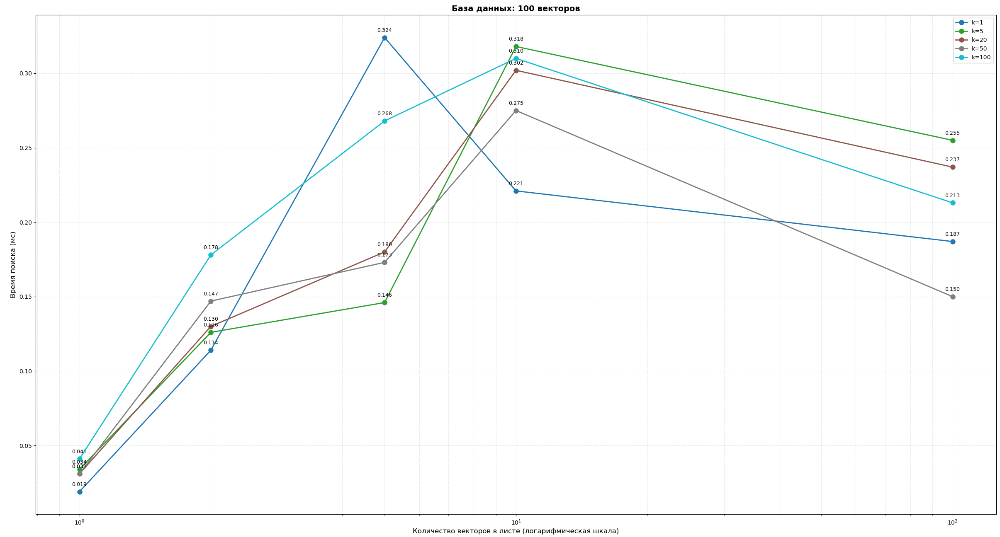
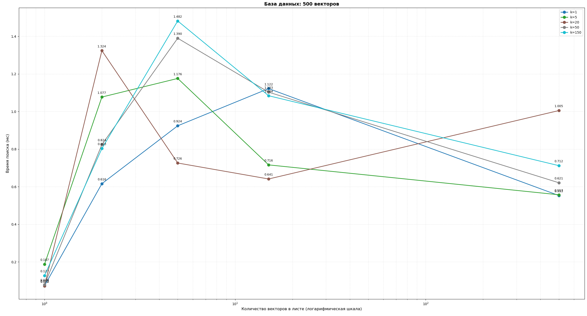
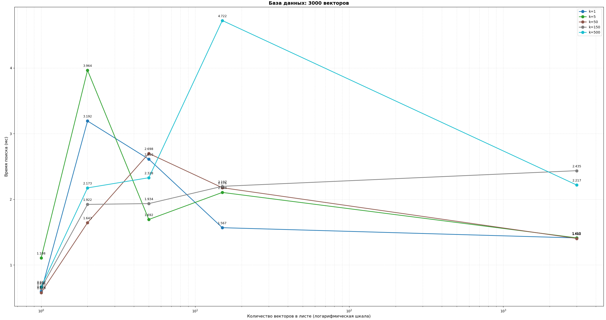
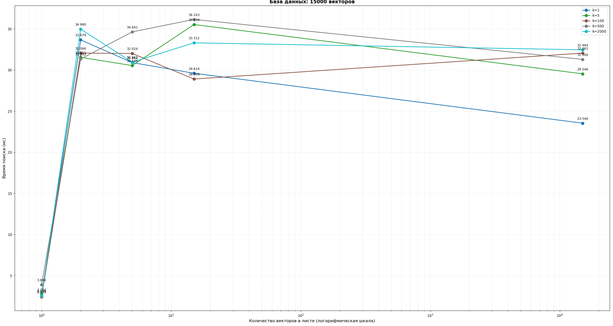
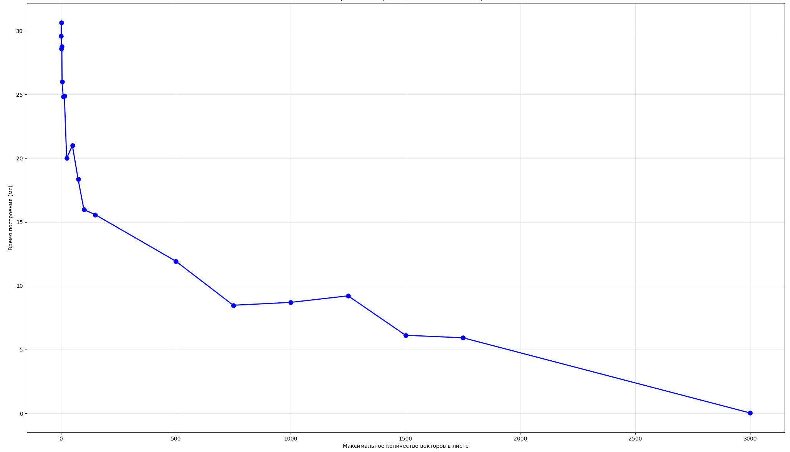

# Анализ деревьев для векторного поиска

Изученные структуры данных из книги **Sebastian Bruch** *"Foundations of Vector Retrieval"*:

- **k-d Tree**
- **RP-Tree (Random Projection Tree)**
- **Spill Tree**
- **Cover Tree**

## Назначения файлов
- **for_img** - Папка для фото
- **filling_db.cpp** - Заполнение/перезаполнение базы данных, генерация случайных разреженных d-мерных векторов
- **kd_Tree.cpp** - Реализация алгоритма построения k-d tree и поиска в нём
- **analysis_retrieval_time** - Построение графиков для анализа зависимости времени top-k retrieval от максимального количества векторов в листе
- **analysis_build_time** - Построение графика для анализа зависимости времени построения k-d tree от максимального количества векторов в листе

## Результаты анализа k-d tree

Исходя из представленных графиков, можно сделать вывод о том, что 1 вектор в листе k-d tree является лучшим вариантом при top-k retrieval. Стоит отметить, что данное максимальное количество векторов в листе является оптимальным только с точки зрения времени поиска. Для построения, наоборот, выгоднее помещать в лист как можно больше векторов - это экономит время построения дерева и выделяемую под него память. 

График, показывающий зависимость времени построения дерева от максимального количества векторов в листе (размер векторной базы данных 3000):

